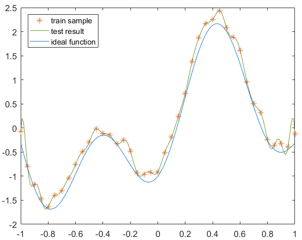
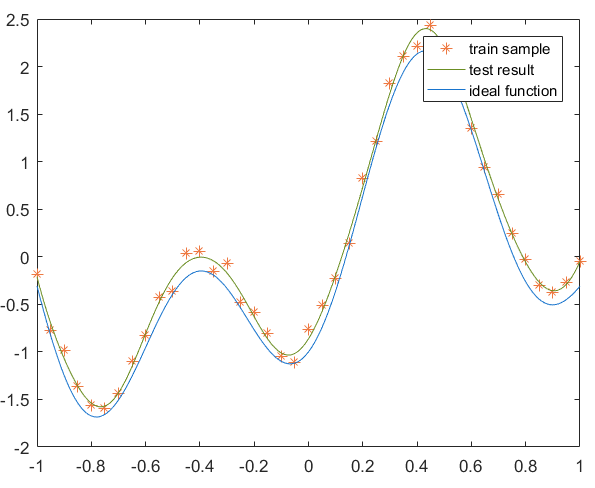
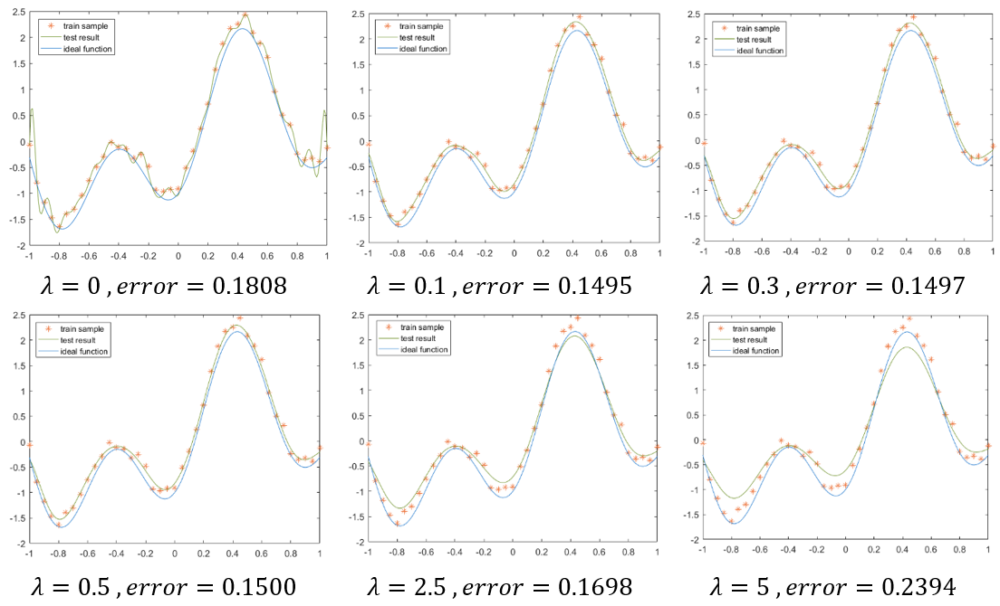
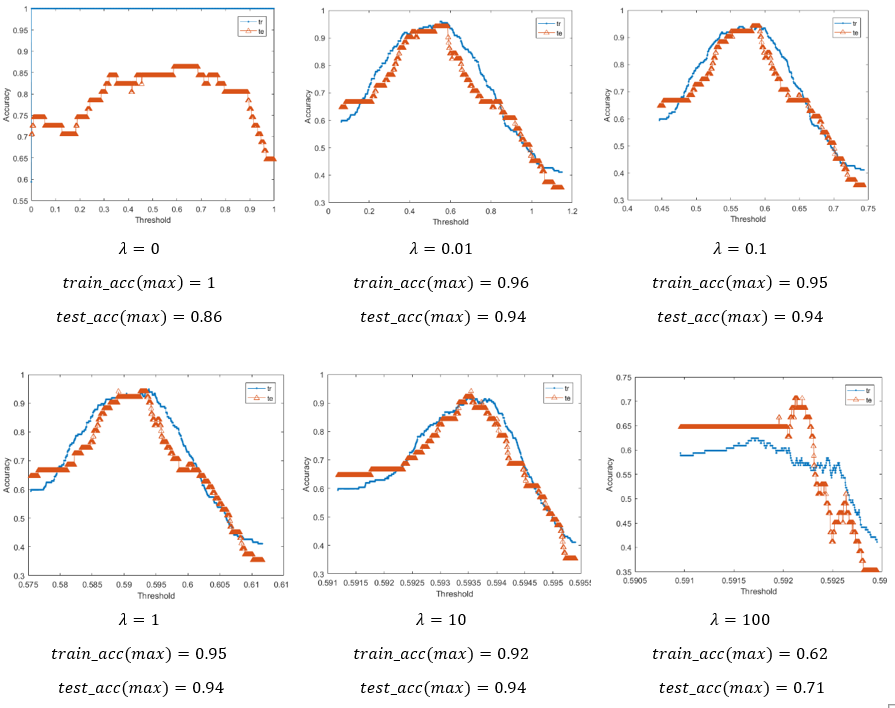
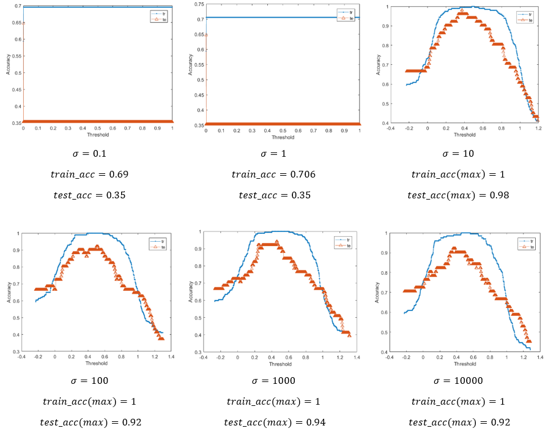
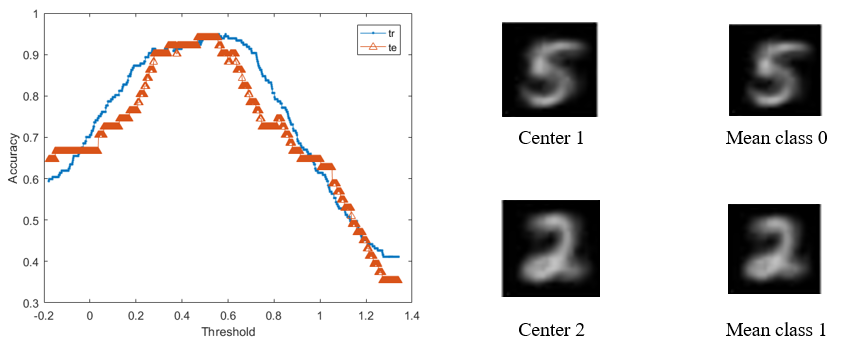
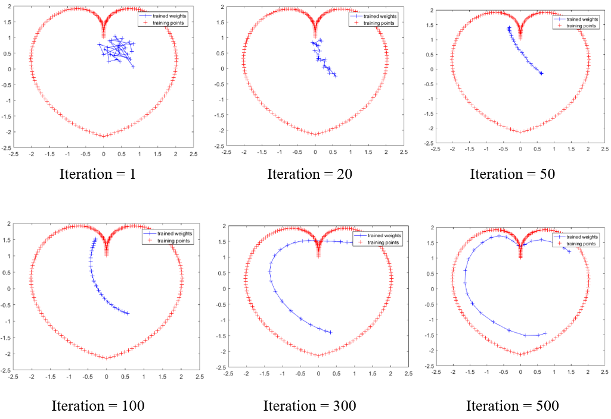
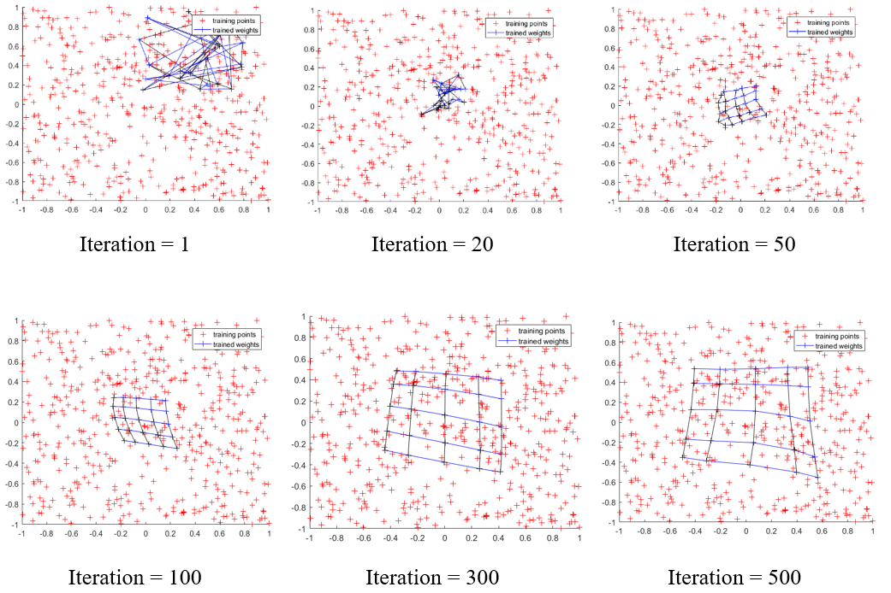
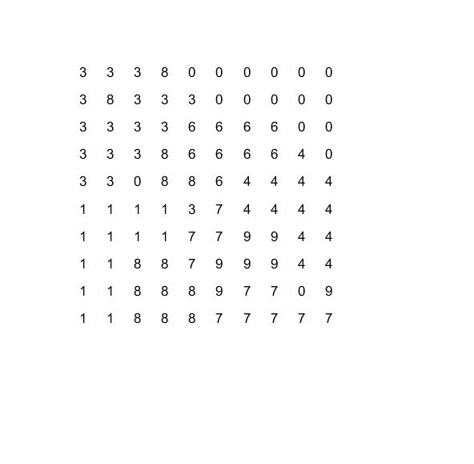
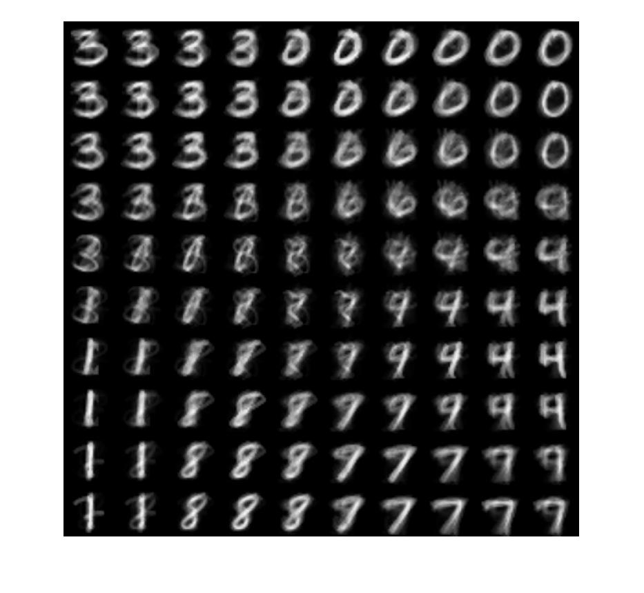

# ME5405-Neuron-Networks-Homework3

## 1.Function Approximation with RBFN  

$y=1.2sin(πx)-cos(2.4πx), for -1<=x<=1$  

a)use the exact interpolation method  

  

b)Fixed centers selected at random  

  

c)Regulization  

  

## 2.Handwritten Digits classification using RBFN  

a) Use RBFN and regularization method to evaluate the performance of MINIST_database of 5 and 2  

  

b) Apply the strategy of Fixed centers selected at random  

  

c)Use K-Means clustering  

  

## 3. SOM

a)Implement SOM map a 1-dimension output layer of a "heart curve"  

  

b)Implement SOM map 2D output layer of 25 neurons  
  

c)Implement SOM for classification of handwritten digits of 5 and 2  
 
 
